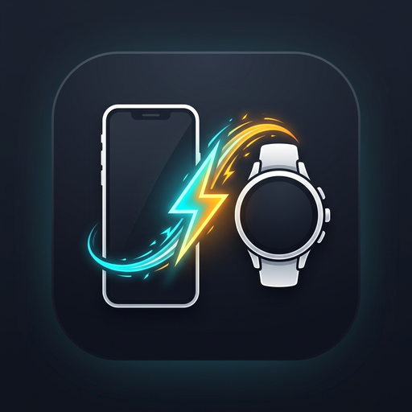
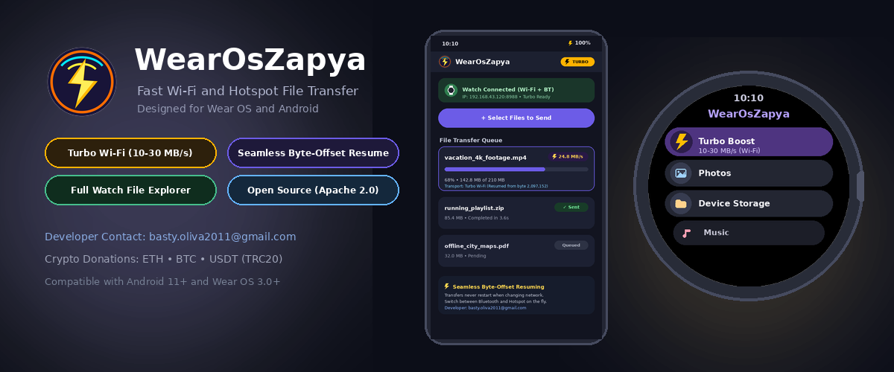
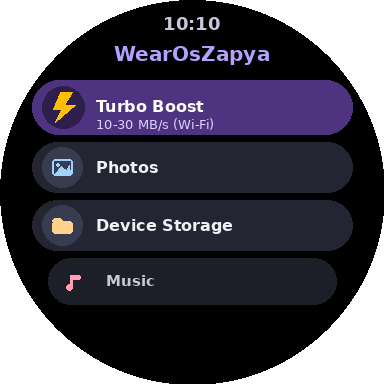
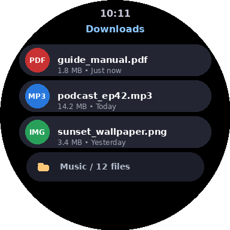
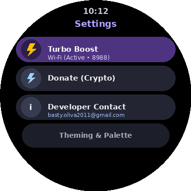
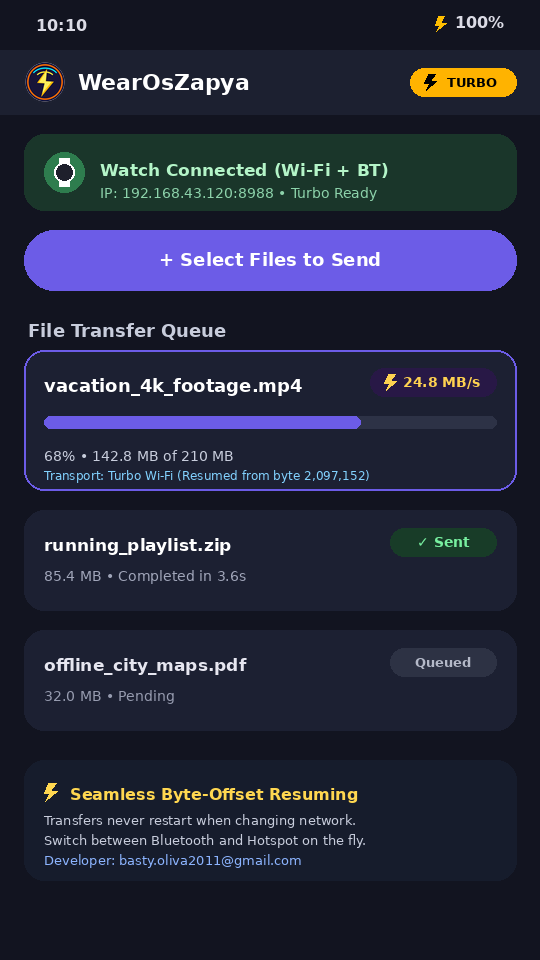
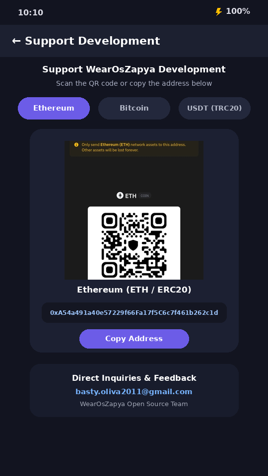

# WearOsZapya

   
  

WearOsZapya — инструмент для передачи файлов и файловый менеджер для Wear OS и Android в стиле Zapya и SHAREit.

Стандартная передача файлов на Wear OS работает через Bluetooth со скоростью 20-50 КБ/с. WearOsZapya добавляет высокоскоростной режим Wi-Fi и точки доступа (10-30 МБ/с) с надежным переключением на Bluetooth при обрыве. Если начать передачу по Bluetooth, при подключении к Wi-Fi передача переключается автоматически и продолжается с точного байта.

## Скриншоты

  
  
  
  
  

## Основные возможности

- ⚡ **Turbo Boost (Передача по Hotspot / Wi-Fi)**:
  - Прямой TCP-стриминг со скоростью 10–30 МБ/с.
  - Автоматическая активация высокоскоростного сетевого интерфейса Wi-Fi (`NetworkCapabilities.TRANSPORT_WIFI`) на Wear OS в обход ограничений Bluetooth.
- 🔄 **Бесшовное переключение и докачка с любого байта**:
  - Передача стартует моментально по Bluetooth без ожидания Wi-Fi.
  - При появлении точки доступа или сети Wi-Fi передача переключается на Turbo-режим.
  - **Никаких сбросов**: Если 2 МБ уже передано по Bluetooth, Turbo-режим продолжает с байта `2 097 152` через `RandomAccessFile`.
  - При обрыве Wi-Fi связь автоматически возвращается на Bluetooth.
- 📂 **Полноценный файловый менеджер для Wear OS**:
  - Навигация по файловой системе часов, удаление и переименование.
  - Буфер обмена: вырезать, копировать, вставить.
  - Закрепление часто используемых файлов и папок на главном экране.
  - Встроенные просмотрщики: Фото, Музыка, Видео и PDF-документы.

---

## 💎 Поддержать проект (Crypto)

| Монета / Сеть | Адрес |
| :--- | :--- |
| **Ethereum (ETH)** | `0xA54a491a40e57229f66Fa17f5C6c7f461b262c1d` |
| **Bitcoin (BTC)** | `bc1q78zrnqxes8gdg8c9l34z4sg5258xpsz72at23x` |
| **Tether (USDT TRC20)** | `TVfsR7tHZvbKGK9gMasXFxcoGL43yNG6jV` |

---

## 📬 Контакты

- **Email разработчика**: [basty.oliva2011@gmail.com](mailto:basty.oliva2011@gmail.com)
- **Репозиторий**: [https://github.com/bastyoliva/wearoszapya](https://github.com/bastyoliva/wearoszapya)

---

## 📄 Лицензия
WearOsZapya распространяется под лицензией Apache License 2.0.
